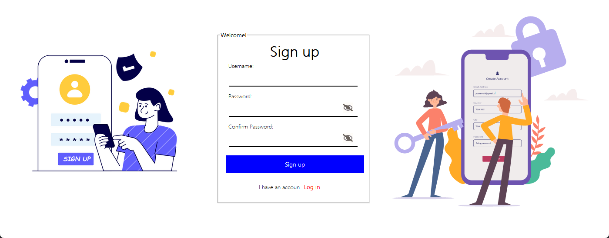
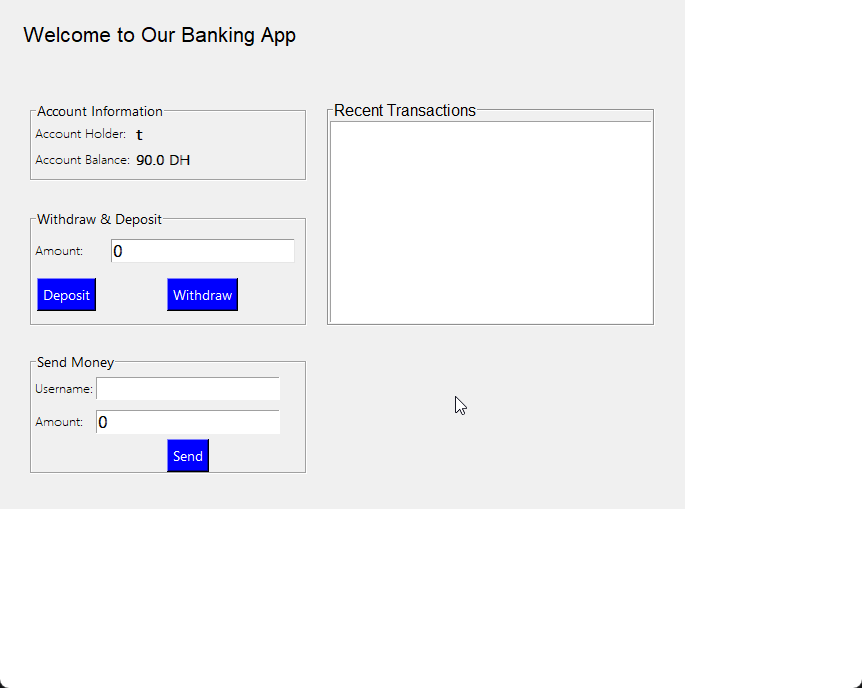

# 🏦 Python Banking Application

A simple GUI banking application built with Python and Tkinter. This is a beginner-friendly project that demonstrates basic file operations, user authentication, and transaction management using text files as a database.


---

## 📋 Table of Contents

- [About This Project](#-about-this-project)
- [Features](#-features)
- [Screenshots](#-screenshots)
- [Technologies Used](#-technologies-used)
- [Installation](#-installation)
- [Usage](#-usage)
- [Project Structure](#-project-structure)
- [How It Works](#-how-it-works)
- [Limitations](#-limitations)
- [Future Improvements](#-future-improvements)
- [Contributing](#-contributing)
- [License](#-license)

---

## 💡 About This Project

This was my **first Python project** - a learning experience to understand:
- File I/O operations in Python
- GUI development with Tkinter
- Basic user authentication
- Managing application state

**⚠️ Important Note:** This is a **learning project** and should not be used for real banking applications. It has no encryption, password hashing, or security features.

---

## ✨ Features

### 🔐 User Authentication
- **Sign Up** - Create new user accounts
- **Login** - Access existing accounts with username/password
- **Password Visibility Toggle** - Show/hide password while typing

### 💰 Banking Operations
- **Check Balance** - View current account balance in real-time
- **Deposit Money** - Add funds to your account
- **Withdraw Money** - Remove funds from your account
- **Send Money** - Transfer funds to other users
- **Transaction History** - View recent transactions with timestamps

### 🎨 User Interface
- Clean, modern GUI built with Tkinter and CustomTkinter
- Responsive design with custom styling
- Visual feedback for all operations
- Password visibility toggle buttons

---

## 📸 Screenshots

### Login Screen
```

```

### Sign Up Screen
```

```

### Banking Dashboard
```

```

---

## 🛠️ Technologies Used

- **Python 3.7+**
- **Tkinter** - Standard GUI library
- **CustomTkinter** - Modern Tkinter widgets
- **Text Files (.txt)** - Data storage

### Python Libraries Used:
```python
import time
import datetime
import tkinter
import customtkinter
```

---

## 📥 Installation

### Prerequisites

Make sure you have Python 3.7+ installed on your system.

### Step 1: Clone the Repository

```bash
git clone https://github.com/yourusername/banking-app.git
cd banking-app
```

### Step 2: Install CustomTkinter

```bash
pip install customtkinter
```

### Step 3: Add Required Images (Optional)

The app uses these image files for the UI:
- `login.png` - Login screen decoration
- `signup.png` - Signup screen left image
- `signup2.png` - Signup screen right image
- `closeye2.png` - Closed eye icon (hide password)
- `openeye.png` - Open eye icon (show password)

**Note:** The app will run without these images, but won't display the decorative elements.

### Step 4: Run the Application

```bash
python banking_app.py
```

---

## 🚀 Usage

### First Time Setup

1. **Run the application**
   ```bash
   python banking_app.py
   ```

2. **Create an account**
   - Click "Sign up"
   - Enter a username
   - Enter a password (must be more than 6 characters)
   - Confirm your password
   - Click "Sign up"

3. **Login**
   - Enter your username
   - Enter your password
   - Click "Log in"

### Banking Operations

Once logged in, you can:

#### ✅ Deposit Money
1. Enter amount in the "Amount" field
2. Click "Deposit" button
3. Balance updates automatically

#### ✅ Withdraw Money
1. Enter amount in the "Amount" field
2. Click "Withdraw" button
3. Must have sufficient balance

#### ✅ Send Money
1. Enter recipient's username
2. Enter amount to send
3. Click "Send" button
4. Recipient must exist in the system

#### ✅ View Transaction History
- All transactions appear in the "Recent Transactions" list
- Shows amount, type, and date


### Data File Format

**Accounts.txt** stores user data in this format:
```
username, password, balance
john_doe, mypassword123, 1500.5
jane_smith, password456, 2300.0
```

**⚠️ Security Warning:** Passwords are stored in **plain text** - this is NOT secure!

---

## 🔧 How It Works

### Class Structure

#### **AccountManager**
Handles all file operations:
- `load_accounts()` - Reads data from Accounts.txt
- `username_exists()` - Checks if username is taken
- `create_account()` - Creates new user account
- `update_balance()` - Updates user balance
- `get_balance()` - Gets current balance

#### **LoginWindow**
Main login interface:
- Username and password entry
- Login validation
- Opens RegisterWindow or BankingAppWindow

#### **RegisterWindow**
Sign up interface:
- New user registration
- Password confirmation
- Username uniqueness check

#### **BankingAppWindow**
Main banking dashboard:
- Displays account info and balance
- Handles deposits, withdrawals, transfers
- Shows transaction history

### Data Flow

```
User Input → GUI Window → AccountManager → Accounts.txt
                ↓
         Update Display ← Read Data ← Accounts.txt
```


---

## 🤝 Contributing

This is a learning project, but contributions are welcome! Here's how:

1. Fork the repository
2. Create a feature branch (`git checkout -b feature/AmazingFeature`)
3. Commit your changes (`git commit -m 'Add some AmazingFeature'`)
4. Push to the branch (`git push origin feature/AmazingFeature`)
5. Open a Pull Request

### Contribution Ideas
- Improve security
- Add new features
- Fix bugs
- Improve documentation
- Add tests
- Improve UI design

---

## 📚 What I Learned

Building this project taught me:

✅ File I/O operations in Python
✅ Creating GUI applications with Tkinter
✅ Managing application state
✅ Basic user authentication flow
✅ Event-driven programming
✅ Working with CustomTkinter widgets
✅ Structuring code with classes

---

## 📞 Contact

**omar bouazzaoui** - bouazzaouiomar21@email.com

---

<div align="center">

**⚠️ Educational Project - Not for Production Use ⚠️**

Made with Python as a learning experience

**⭐ If this helped you learn, please star the repo! ⭐**

</div>
